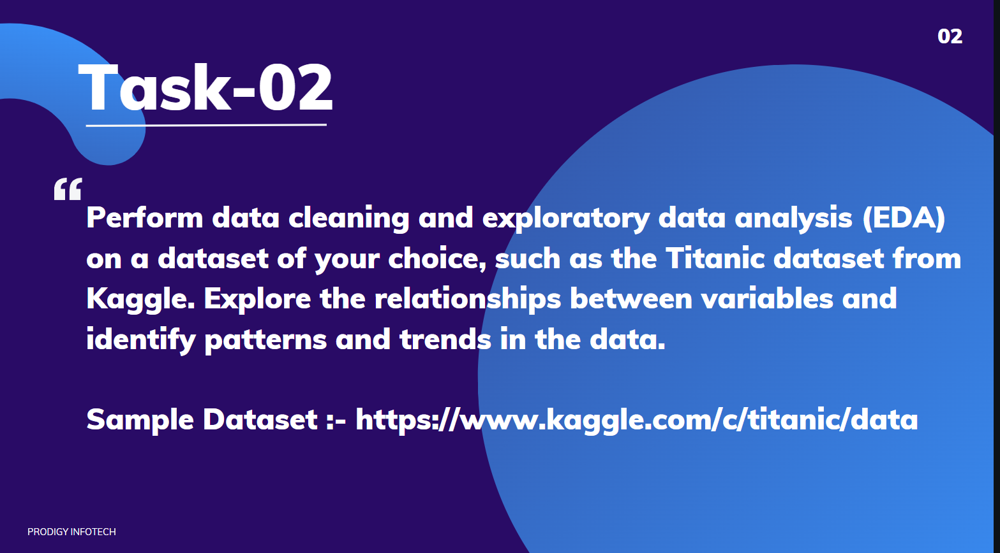

# TASK-2
Perform data cleaning and exploratory data analysis (EDA) on a dataset of your choice, such as the Titanic dataset from Kaggle. Explore the relationships between variables and identify patterns and trends in the data.

  
Welcome to my submission for Task 2 of the Data Science Internship at Prodigy Infotech. In this task, I have performed Data Cleaning and Exploratory Data Analysis (EDA) on a dataset of my choice, the popular Titanic dataset from Kaggle, focusing on exploring relationships between variables and identifying patterns and trends.

## Dataset
The dataset used for this task is the <a href="">Dataset</a>.Titanic dataset. This dataset provides information on the passengers aboard the Titanic, including variables such as age, gender, class, and survival status. The aim is to explore how these variables relate to one another and discover insights into survival patterns.

## Tools and Libraries used
Jupyter notebook
Pandas
Numpy
Matplotlib & Seaborn for visualization
Scikit-learn for preprocessing
## Exploratory Data Analysis (EDA)
During the EDA process, I performed the following steps:

Data Cleaning:
Checked for missing values and handled them (e.g., missing values in 'Age', 'Cabin', and 'Embarked' columns).
Handled outliers using appropriate techniques.
Transformed categorical variables into numerical ones for further analysis.
Visualization:
Created visualizations (e.g., bar charts, heatmaps, and histograms) to explore the relationships between variables such as Gender, Class, Survival, and Age.
Used a correlation heatmap to understand how numerical features are related.
Survival Analysis:
Analyzed survival rates based on gender, class, and age group.
Explored the impact of fare and family size on survival.
## Conclusion
This EDA provided interesting insights into the factors influencing survival on the Titanic. For instance, females had a significantly higher survival rate, and passengers in first-class were more likely to survive. These findings set the stage for future predictive modeling tasks.

Thank you for reviewing my submission!

## 📬 Contact

For any inquiries or feedback regarding this project, please contact:

- <a>[Pramod Doddmane ](https://www.linkedin.com/in/pramoddr)(LinkedIn)</a>
- Email:pramoddoddmane@gmail.com 
